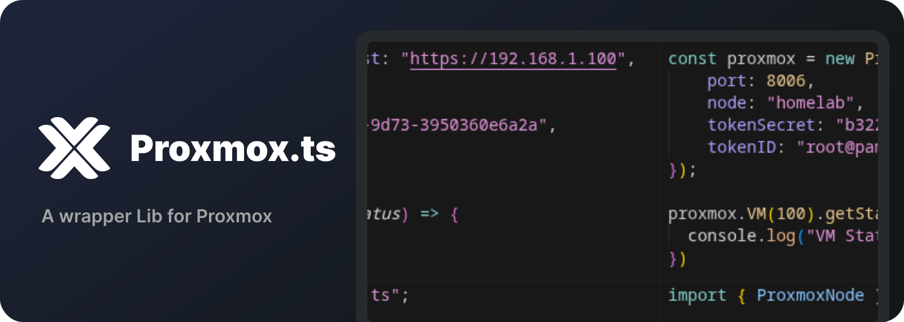

<div align="center">
  <p align="center">
    <a href="#">
      
    </a>
  </p>
</div>

<p align="center">
  <strong>Proxmox.ts</strong>
</p>

<p align="center">
  An API wrapper for Proxmox VE.
</p>

<p align="center">
  
  <a href="https://www.typescriptlang.org/">
    
  </a>
  <a href="https://bun.sh/">
    
  </a>
</p>

---

## 📦 Installation

```bash
#Use package manager of your choice
npm install proxmox.ts 
bun install proxmox.ts
```